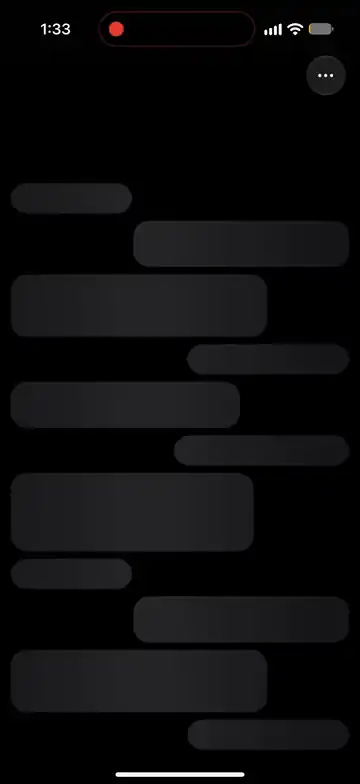
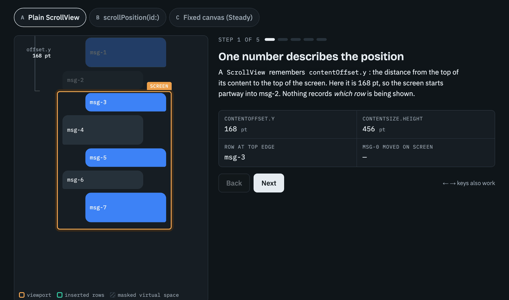

# Steady

**A chat list for iOS that holds still.**

<p align="center">
  <a href="docs/media/demo.mp4">
    
  </a>
</p>

I've lost count of how many times this has happened to me.

You're scrolling back through an old chat, hunting for the address someone
sent you in March. You find roughly the right spot, start reading, and the
whole screen lurches. The app has quietly fetched another batch of older
messages and stuffed them in above you, and the line you were reading has been
shoved off the bottom of the screen. You scroll down to find it again. It
happens again.

Almost every chat app handles this the same way. It lets the jump happen, then
scrolls you back so fast you don't notice. Most of the time it gets away with
it. Flick a little too quickly, though, or catch it while a photo is still
loading, and you'll see the hop.

I wanted a list that simply doesn't move. So I made one.

<p align="center">
  
</p>

## How it stays still

Imagine your conversation pinned to an absurdly tall wall. A million points
tall, to be exact, which is over a thousand iPhone screens stacked end to end,
roughly the height of a fifty-storey building. And it never gets any taller.

Your chat starts in the middle. Older messages get pinned above, newer ones
below, always onto bare wall that was already there. A curtain covers the
empty parts, so you can't scroll off into nothing.

When older messages arrive, Steady pins them up and lifts the curtain a
little. Nothing that was already on the wall moves, so nothing on your screen
moves either. There's no jump to hide, because there never was one.

<p align="center">
  
</p>

<details>
<summary>Want to see the numbers?</summary>

<br>

Here's one batch of older messages arriving, first in a plain list and then in
Steady. Watch *msg-0 moved on screen*: 240 points in the plain list, zero in
Steady. You can also [click through it yourself](docs/prepend-jump.html).

<a href="docs/prepend-jump.html#virtual/0">
  
</a>

For the UIKit-minded: `contentSize` never changes, older rows sit at negative
offsets from an anchor in the middle, negative `contentInset`s are the curtain,
and adding older messages only touches `contentInset.top`. `contentOffset` is
never written. It all lives in [`ChatLayout.swift`](Sources/Steady/Layout/ChatLayout.swift).

</details>

## Getting it

In Xcode, go to **File › Add Package Dependencies** and paste
`https://github.com/RunTerror/Steady.git`. If you'd rather use `Package.swift`:

```swift
.package(url: "https://github.com/RunTerror/Steady.git", from: "0.1.0")
```

This is version 0.1. It works, and the example app shows it off, but it will
still change a little before 1.0.

## Using it

Steady wants three things from you: what a message looks like, how tall it is,
and where the older messages come from. It takes care of the rest.

```swift
import Steady

let list = ChatListViewController<Message>()

list.cellProvider = { collectionView, indexPath, message in
    collectionView.dequeueConfiguredReusableCell(using: registration, for: indexPath, item: message)
}
list.heightProvider = { message, width in
    MessageCell.height(for: message, width: width)
}
list.onNeedsOlder = { oldest in
    Task { list.prepend(await api.page(before: oldest.id)) }
}

list.setItems(await api.latest())
```

Using SwiftUI? Wrap it in a `UIViewControllerRepresentable`. The example app
does exactly that in [`ChatListView.swift`](Example/SteadyExample/Chat/ChatListView.swift).

<details>
<summary>Everything you can tweak</summary>

<br>

| Property | What it's for |
|---|---|
| `cellProvider` | The cell for a message. |
| `heightProvider` | How tall a message is at a given width. Steady remembers the answer. |
| `onNeedsOlder` | Called as the reader nears the top. Answer with `prepend(_:)`. An empty page means there's no more history. |
| `contextMenuProvider` | The menu that appears on a long press, or `nil` for none. |
| `topInset`, `bottomInset` | Breathing room above the first message and below the last. |
| `loadingView` | What to show before the first page arrives. |
| `showsScrollIndicator` | Off unless you turn it on. |
| `prefetchFraction` | How early to start loading, from 0 (the very top) to 1. Defaults to 0.25. |

| Method | When to call it |
|---|---|
| `setItems(_:)` | The first page. The list opens at the newest message. |
| `prepend(_:)` | An older page. Messages it already has are skipped, so overlapping pages are fine. |
| `append(_:from:)` | A new message, optionally flying in from the composer. If it's already in the list, say a sent message echoed back by your server, it's updated in place. |

A cell that adopts `ChatContextMenuPreviewing` can hand the long-press menu
just its bubble to lift, instead of the whole row.

</details>

## Try it before you trust it

Open the app in [`Example/`](Example/) and run it. Pick any message, keep your
eye on it, and scroll up slowly. Batches of older messages keep arriving above
it, and it doesn't so much as twitch.

## What it doesn't do (yet)

I'd rather you hear the limits from me than discover them at 2 a.m.

The wall is tall, not endless. It holds about five thousand messages in each
direction from wherever your chat opens. If your users scroll back further
than that in one sitting, I'd honestly love to meet them.

Steady gets message heights from you instead of measuring cells itself. That's
how it places everything so precisely, but it does mean your height function
and your cell have to agree. Keep them side by side and they will.

The scroll bar only knows about messages that have already loaded, so it
creeps down every time an older page arrives. That's why it stays off unless
you ask for it.

A few things aren't built yet: deleting messages, edits that change a
message's height, reacting when someone changes their text size, and a way to
tell Steady that a page failed to load. They're next.

## If Steady helped

<p align="center">
  
</p>

If Steady saved you an afternoon of wrestling with scroll offsets, the nicest
thank-you is a star. It's genuinely how other developers find it.

<p align="center">
  <a href="https://github.com/RunTerror/Steady/stargazers"></a>
</p>

Found a bug, or have an idea? [Open an issue](https://github.com/RunTerror/Steady/issues).
I read every one.

---

<sub>Made with too much chai by Gaajar, starting 21 September 2026 · iOS 17 or later · [MIT licence](LICENSE)</sub>
